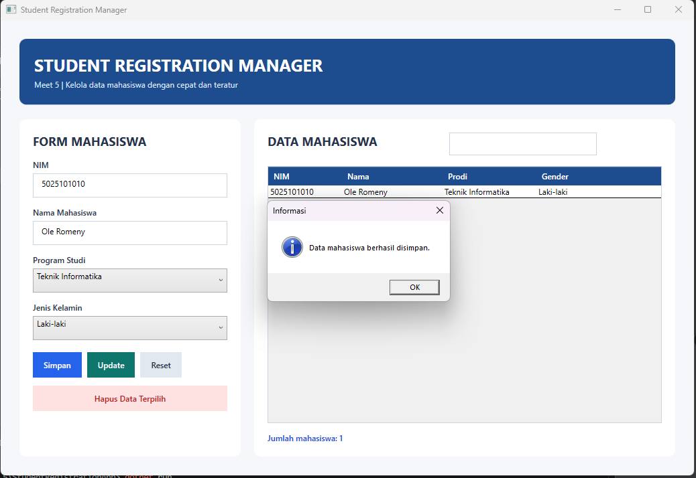
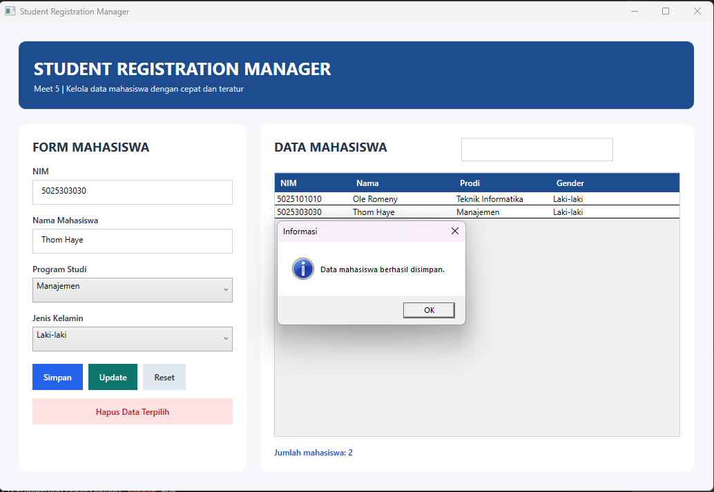
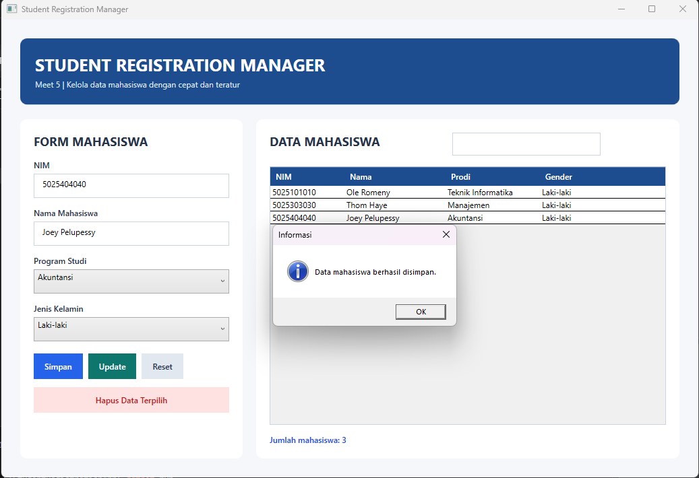
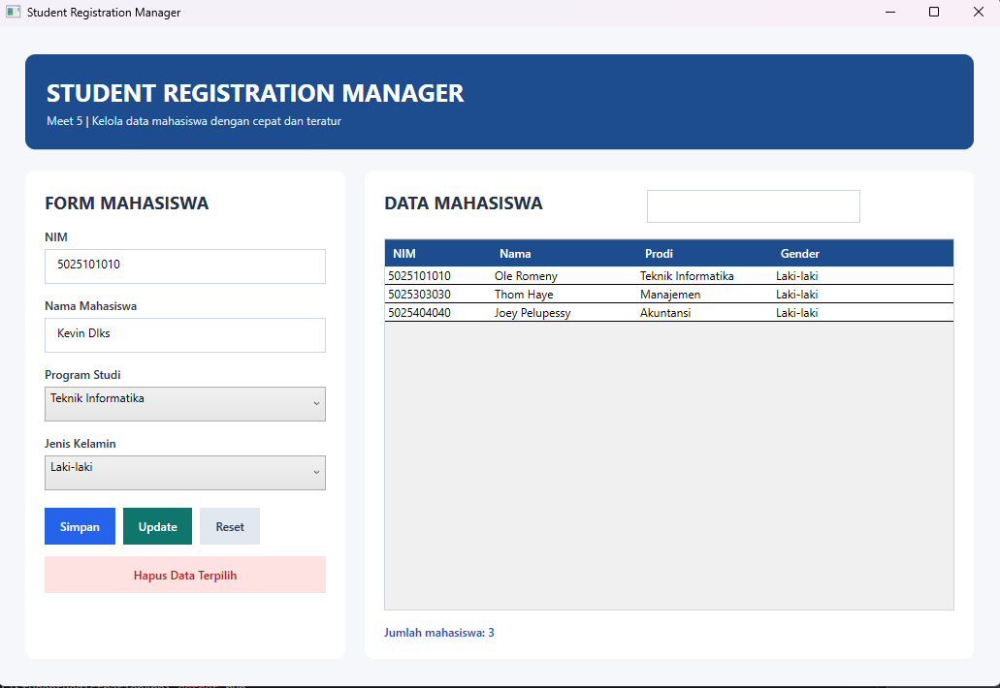
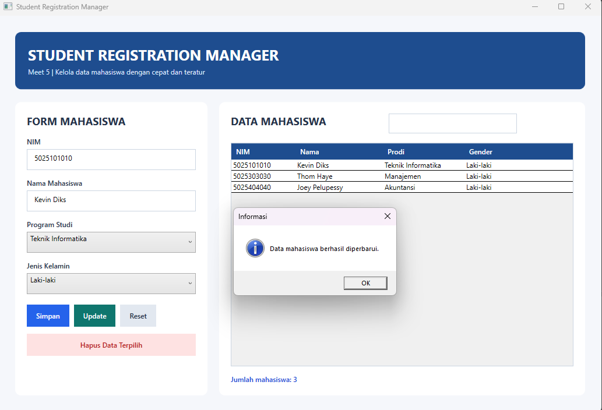
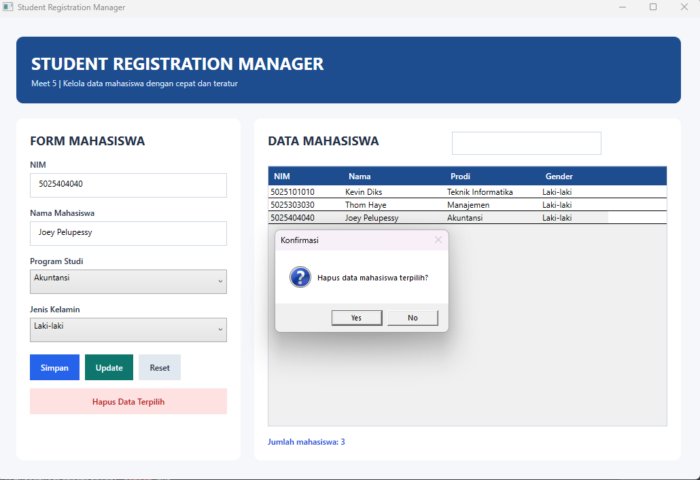

# Meet 5 - Student Registration Manager dengan MVVM

**Nama :** Leyan Harits R W  
**NRP  :** 5025231288

Meet 5 merupakan kelanjutan langsung dari Meet 4. Aplikasi registrasi mahasiswa dan fitur intinya tetap dipertahankan, kemudian struktur program dipisahkan menggunakan pola **Model-View-ViewModel (MVVM)**. Perubahan ini membuat kode lebih terorganisasi tanpa mengubah hubungan antara form, data mahasiswa, dan operasi CRUD.

## Fokus Meet 5

Fokus utama tugas ini adalah menerapkan MVVM pada aplikasi WPF:

1. **View** berupa `MainWindow.xaml` menampilkan UI dan binding.
2. **ViewModel** mengelola state form, validasi, pencarian, dan command.
3. **Model** mendefinisikan data mahasiswa.
4. **Repository** menjadi lapisan penyimpanan data sementara.
5. **RelayCommand** menghubungkan tombol XAML ke aksi ViewModel tanpa event handler di code-behind.

Alur aplikasi:

```text
Pengguna
    |
    v
MainWindow.xaml
    |  Data Binding dan ICommand
    v
MahasiswaViewModel
    |
    +--> MahasiswaRepository
    |        |
    |        v
    |    Mahasiswa Model
    |
    +--> Validasi dan notifikasi
```

## Fitur Aplikasi

- Input NIM, nama mahasiswa, program studi, dan jenis kelamin.
- Menampilkan data menggunakan `DataGrid`.
- Menyimpan data mahasiswa.
- Memilih data pada tabel untuk mengisi kembali form.
- Memperbarui data menggunakan tombol `Update`.
- Menghapus data dengan konfirmasi.
- Reset form.
- Pencarian berdasarkan NIM, nama, atau program studi.
- Validasi semua input wajib.
- Counter jumlah mahasiswa.
- UI custom yang dibuat berbeda dari screenshot contoh.

## Penjelasan Struktur MVVM

Meet 5 memisahkan tampilan, data, dan logika menggunakan pola MVVM.

### Model

`Models/Mahasiswa.cs` adalah representasi data mahasiswa yang berisi NIM, nama, program studi, dan jenis kelamin. Model juga menyediakan fungsi pencarian sederhana.

### View

`MainWindow.xaml` berisi tampilan aplikasi seperti `TextBox`, `ComboBox`, `DataGrid`, dan `Button`. Tidak ada logika CRUD di dalam XAML.

### ViewModel

`ViewModels/MahasiswaViewModel.cs` menjadi pusat logika aplikasi. Class ini menangani properti form melalui `INotifyPropertyChanged`, binding data ke `DataGrid`, validasi input, operasi CRUD, pencarian, dan counter.

`ViewModels/RelayCommand.cs` menerapkan `ICommand` sehingga tombol dapat memanggil method ViewModel melalui binding.

### Repository

`Data/MahasiswaRepository.cs` memisahkan operasi koleksi data dari ViewModel. Saat ini penyimpanan masih berada di memory agar tetap sesuai level praktikum. Database SQL dapat ditambahkan kemudian tanpa harus mengubah tampilan.

### Code-behind

`MainWindow.xaml.cs` hanya membuat `MahasiswaRepository` dan menetapkan `MahasiswaViewModel` sebagai `DataContext`. Dengan demikian, code-behind tidak menampung logika bisnis.

## Struktur Project

```text
Meet 5/
├── README.md
├── Images/
│   ├── 1.png
│   ├── 2.png
│   ├── 3.png
│   ├── 4.png
│   ├── 5.png
│   ├── 6.png
│   └── 7.png
└── StudentRegistrationApp/
    ├── App.xaml
    ├── App.xaml.cs
    ├── MainWindow.xaml
    ├── MainWindow.xaml.cs
    ├── Data/
    │   └── MahasiswaRepository.cs
    ├── Models/
    │   └── Mahasiswa.cs
    ├── ViewModels/
    │   ├── MahasiswaViewModel.cs
    │   └── RelayCommand.cs
    └── StudentRegistrationApp.csproj
```

## Menjalankan Project

VS Code sudah cukup untuk mengedit XAML/C# dan menjalankan project karena .NET SDK serta Windows Desktop Runtime tersedia.

```powershell
cd "D:\SEMESTER 7\PBKK D\Meet 5\StudentRegistrationApp"
dotnet build
dotnet run
```

Visual Studio tidak wajib. Visual Studio hanya memberikan XAML Designer dan preview visual tambahan. Project dapat dibuka melalui `StudentRegistrationApp.csproj` jika ingin menggunakan Visual Studio.

## Skenario Pengujian

| No. | Skenario | Hasil Pengujian |
| --- | --- | --- |
| 1 | Menyimpan data pertama | Data masuk ke DataGrid dan pesan berhasil muncul. |
| 2 | Menyimpan data kedua | Counter berubah menjadi dua mahasiswa. |
| 3 | Menyimpan data ketiga | Data ketiga tampil dan counter menjadi tiga mahasiswa. |
| 4 | Memilih data pada tabel | Data terpilih dimuat kembali ke form. |
| 5 | Mengubah data lalu menekan `Update` | Pesan berhasil diperbarui muncul dan data tabel berubah. |
| 6 | Menekan `Hapus Data Terpilih` | Dialog konfirmasi penghapusan muncul. |
| 7 | Menekan `Yes` | Data terpilih terhapus dan counter berkurang menjadi dua. |

## Dokumentasi Uji Coba

### 1. Menyimpan Data Pertama



### 2. Menyimpan Data Kedua



### 3. Menyimpan Data Ketiga



### 4. Memilih Data untuk Diperbarui



### 5. Konfirmasi Update Berhasil



### 6. Konfirmasi Penghapusan



### 7. Hasil Setelah Data Dihapus

